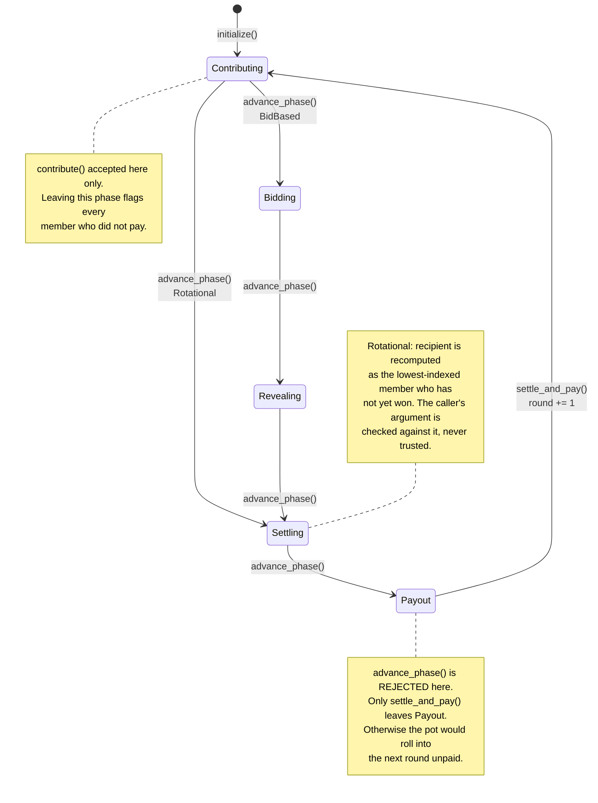
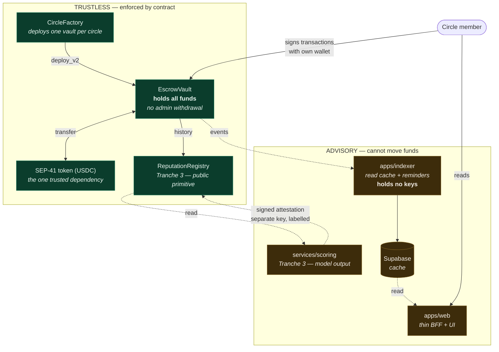
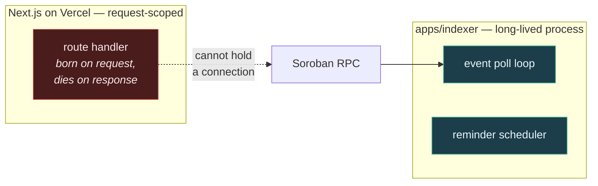

# Architecture diagrams

## Round lifecycle

One circle, one round. Phases advance exactly one step at a time, and only
once the deadline has passed. Rotational circles skip the two bidding phases
through an explicit arm in the transition table, not by omission — see
`next_phase` in `contracts/escrow-vault/src/lib.rs`.

Two properties of this diagram are load-bearing:

- **Every transition is `advance_phase()` with no arguments.** There is no
  edge a caller can name. That is invariant 2.
- **`advance_phase` and `settle_and_pay` are permissionless.** Anyone may
  drive a circle whose deadline has passed, so no single member can stall the
  round and freeze everyone's funds. That is threat T3.

## Trust boundary

**Every arrow into the advisory box is dotted, because every one of them is a
read.** There is no solid arrow from advisory back into trustless that moves
value. The single arrow pointing back — the scoring service's attestation —
writes model output under a separate storage key, clearly labelled, and
cannot change a contract-enforced fact.

That is the property the whole pitch rests on — protect it in review.

Concretely, in review: if a pull request adds an arrow from the advisory box
into the trustless box, or gives anything in the advisory box a signing key,
that is not a feature with a security consideration. It is a change to what
the product is, and it needs a discussion before it needs a code review.

## Why the indexer is a separate process

A Next.js route handler exists because someone made an HTTP request and is
killed when the response is sent. On Vercel it is a serverless function, so
there is no process to keep a timer in and no guarantee the same instance
exists a minute later.

Event subscription needs a connection that outlives a request. Reminders need
to fire whether or not anyone has the app open. Neither belongs in a route
handler, and putting them there produces a system that appears to work in
development and silently stops in production.
